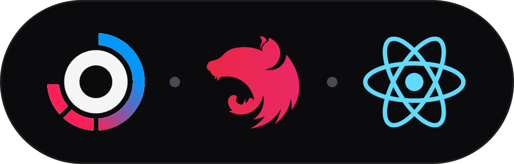
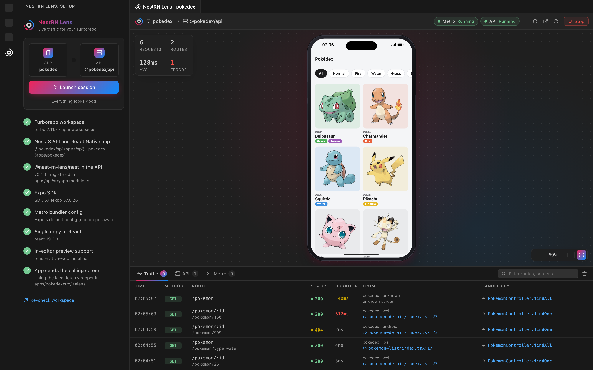
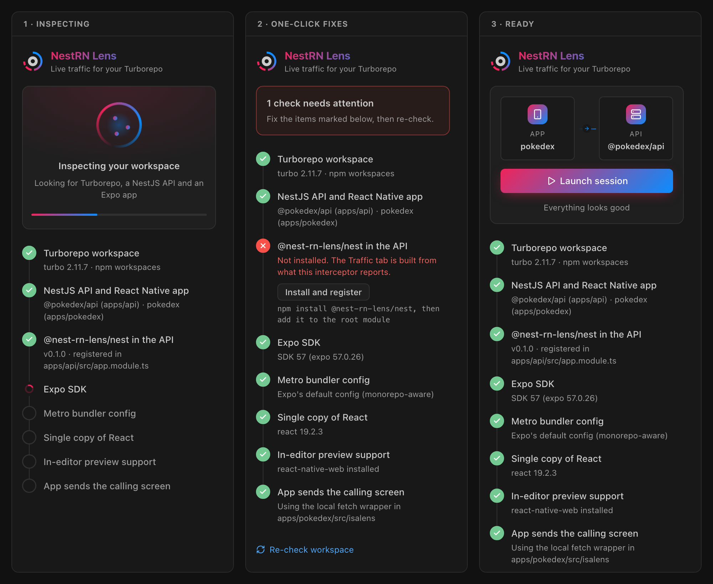
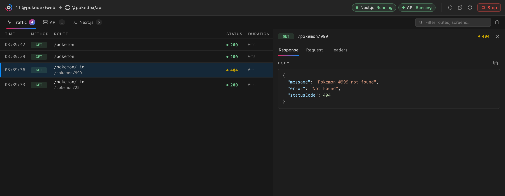
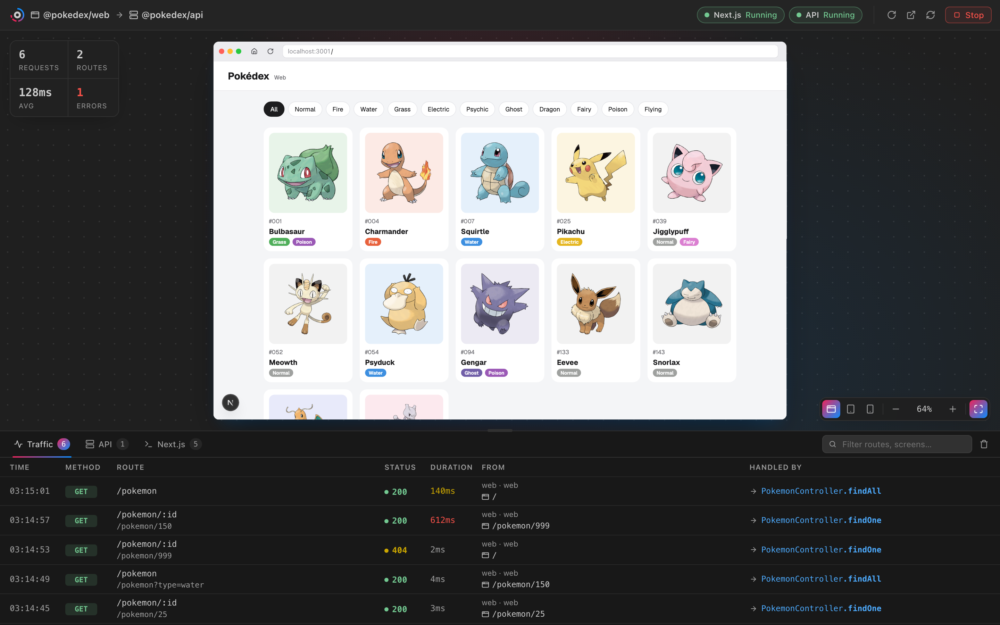

<p align="center">
  
</p>

# NestRN Lens

**Watch your React Native or Next.js app talk to your NestJS API, live, inside VS Code.**

NestRN Lens runs your app and your NestJS API from a Turborepo and opens them
side by side in an editor panel: the app on top (in a phone frame for React
Native, in a browser window for Next.js) and every API request it makes in a
traffic log below. Click a request to jump to the code that sent it or to the
controller method that answered it.

```
GET /orders/:id   200   12ms   mobile · ios   screens/order-details.tsx:23  →  OrdersController.findOne
GET /orders       200    8ms   web · web      /orders                       →  OrdersController.findAll
```



## What you get

- **Setup checks** that confirm your monorepo is ready, and fix what's missing
  with one click.
- **Your app inside VS Code**: an Expo app in a phone frame, running from the
  same Metro server your devices use, or a Next.js app in a browser window with
  Desktop, Tablet and Mobile widths. Zoom from 50% to 200%.
- **A live Traffic log**: method, route, status, duration, the calling screen or
  page and the handler, plus totals for requests, routes, average latency and
  errors.
- **Request and response details**: click a request to see its response body,
  request body, query, route params and headers, with secrets redacted.
- **Jump to code** on both ends of every request.
- **Server logs** for the API and for Metro or Next.js, in their own tabs, with
  search.

## Requirements

| Requirement   | Details                                                                                          |
| ------------- | ------------------------------------------------------------------------------------------------ |
| Monorepo      | A Turborepo (`turbo.json`) using npm, yarn or pnpm workspaces                                    |
| API           | A NestJS app (10, 11 or 12) inside the monorepo                                                  |
| App           | An Expo app (SDK 52 or newer) **or** a Next.js app (13 or newer) inside the monorepo. If you have both, you choose which one to track |
| Interceptor   | [`@nest-rn-lens/nest`](https://www.npmjs.com/package/@nest-rn-lens/nest) in the API. The setup step installs it for you |

For Expo apps, the in-editor preview runs the app's web build, so the app also
needs `react-native-web` and `react-dom`. The setup step installs them too.

The Turborepo can be your workspace folder or sit up to two folders below it.

## Getting started

1. Open your monorepo in VS Code.
2. Click the **NestRN Lens** icon in the Activity Bar.
3. If the monorepo has both a React Native and a Next.js app, pick one under
   **Track**. The choice is remembered for this workspace.
4. Wait for the setup checks. Anything that fails has a fix button: click it,
   and the checks run again when it finishes.
5. Click **Launch session**.

The panel starts your API and the app's dev server (Metro or `next dev`), then
loads the app. Use it in the panel, or on a device or browser of your own, and
watch requests appear in the **Traffic** tab.

## Integrate your app, step by step

Steps 1 and 2 are the same for every app. Then follow the steps for your app,
React Native or Next.js, and launch.

### 1. Add the interceptor to the API

The setup check's **Install and register** button does this for you. By hand:

```bash
npm install @nest-rn-lens/nest   # in the API folder
```

```ts
// The module you pass to NestFactory.create(), usually src/app.module.ts
import { NestRnLensModule } from '@nest-rn-lens/nest';

@Module({
  imports: [NestRnLensModule.forRoot({ app: 'api' }) /* , your other modules */],
})
export class AppModule {}
```

### 2. Allow browser requests (CORS)

Both the Next.js app and the React Native preview run in a browser, on another
port than the API. In the API's `src/main.ts`:

```ts
const app = await NestFactory.create(AppModule);
if (process.env.NODE_ENV !== 'production') {
  app.enableCors();
}
```

### 3a. React Native (Expo)

1. Let the preview run your app's web build. The setup check's **Install**
   button does this:

   ```bash
   npx expo install react-native-web react-dom   # in the app folder
   ```

2. Route your API calls through one helper that names the app. A phone can't
   reach `localhost` on your computer, so build the API URL from the host Metro
   is served from:

   ```ts
   // src/api.ts
   import Constants from 'expo-constants';

   const host = Constants.expoConfig?.hostUri?.split(':')[0] ?? 'localhost';
   export const API_URL = process.env.EXPO_PUBLIC_API_URL ?? `http://${host}:3000`;

   export async function apiFetch<T>(path: string, init: RequestInit = {}): Promise<T> {
     const headers = new Headers(init.headers);
     if (__DEV__) {
       headers.set('x-nest-rn-lens-app', 'mobile'); // the name shown in Traffic
     }
     const response = await fetch(`${API_URL}${path}`, { ...init, headers });
     if (!response.ok) {
       throw new Error(`Request failed (${response.status})`);
     }
     return response.json();
   }
   ```

3. Call your API through it: `const orders = await apiFetch<Order[]>('/orders');`

Requests then show up as `mobile`. Showing the exact file and line of the
calling screen needs a stack trace resolved by Metro, which the upcoming client
package will do for you.

### 3b. Next.js

1. Route your API calls through one helper that names the app and the page:

   ```ts
   // src/lib/api.ts
   export const API_URL = process.env.NEXT_PUBLIC_API_URL ?? 'http://localhost:3000';

   export async function apiFetch<T>(path: string, init: RequestInit = {}): Promise<T> {
     const headers = new Headers(init.headers);
     if (process.env.NODE_ENV !== 'production') {
       headers.set('x-nest-rn-lens-app', 'web'); // the name shown in Traffic
       if (typeof window !== 'undefined') {
         headers.set('x-nest-rn-lens-caller', window.location.pathname);
       }
     }
     const response = await fetch(`${API_URL}${path}`, { ...init, headers });
     if (!response.ok) {
       throw new Error(`Request failed (${response.status})`);
     }
     return response.json();
   }
   ```

2. Call your API through it: `const orders = await apiFetch<Order[]>('/orders');`

Requests from client components (`'use client'`) report their page, for example
`/orders/42`. Requests from Server Components, route handlers and server actions
run on the server, where there's no page, so they only report the app name.

In both apps, only your API receives these headers, because only API calls go
through the helper.

### 4. Launch from VS Code

1. Click the **NestRN Lens** icon. If the monorepo has both apps, choose one
   under **Track**.
2. Check that every step passes.
3. Click **Launch session**. NestRN Lens starts the API (port 3000) and the app:
   Metro (8081) for React Native, `next dev` (3001, or the port your `dev`
   script sets with `-p`) for Next.js.

Don't start the apps yourself with `npm run dev`: the panel can only show the
traffic and logs of servers it started.

## Setup checks



These run for every app:

| Check                               | Passes when                                                      | Fix button                     |
| ----------------------------------- | ---------------------------------------------------------------- | ------------------------------ |
| Turborepo workspace                 | `turbo.json` exists and `turbo` is installed                     | Installs dependencies          |
| NestJS API and a client app         | A workspace depends on `@nestjs/core`, another on `react-native` or `next` | None: these are your apps |
| `@nest-rn-lens/nest` in the API     | The package is installed **and** registered in the root module   | Installs it and registers it   |
| API accepts browser requests (CORS) | The API's `main.ts` enables CORS                                 | None (warning only)            |

Then, for a **React Native** app:

| Check                        | Passes when                                                   | Fix button                                    |
| ---------------------------- | ------------------------------------------------------------- | --------------------------------------------- |
| Expo SDK                     | Expo SDK 52 or newer is installed                             | Installs dependencies                         |
| Metro bundler config         | No `metro.config.js`, or one that extends `expo/metro-config` | None: explains what to change                 |
| Single copy of React         | Only one version of `react` and `react-dom` is installed      | None: explains the `overrides` fix            |
| In-editor preview support    | `react-native-web` and `react-dom` are installed in the app   | Installs the missing ones with `expo install` |
| App sends the calling screen | The app sends the `x-nest-rn-lens-*` headers                  | None (warning only)                           |

Or, for a **Next.js** app:

| Check                      | Passes when                                                      | Fix button            |
| -------------------------- | ---------------------------------------------------------------- | --------------------- |
| Next.js version            | Next.js 13 or newer is installed                                 | Installs dependencies |
| Next.js dev server port    | The app has a `dev` script, and its port doesn't clash with the API's | None: explains what to change |
| App sends the calling page | The app sends the `x-nest-rn-lens-*` headers                     | None (warning only)   |

Every fix that runs a command does it in a visible VS Code terminal, so you can
see exactly what happens.

### What "Install and register" does

It makes two changes to your API, then opens the root module so you can review
them:

1. Runs `npm install @nest-rn-lens/nest` (or `yarn add`, `pnpm add`) in the API
   folder.
2. Adds the module to your root module, the one passed to
   `NestFactory.create()` in `src/main.ts`:

```diff
  import { Module } from '@nestjs/common';
  import { OrdersModule } from './orders/orders.module';
+ import { NestRnLensModule } from '@nest-rn-lens/nest';

  @Module({
-   imports: [OrdersModule],
+   imports: [NestRnLensModule.forRoot({ app: 'api' }), OrdersModule],
  })
  export class AppModule {}
```

`app` is the API's folder name and labels it in the traffic log. If the root
module has an unusual shape, nothing is changed and the check tells you what to
add by hand. To set it up yourself instead, see the
[`@nest-rn-lens/nest` README](https://www.npmjs.com/package/@nest-rn-lens/nest).

## The session panel

| Area      | What it does                                                                                      |
| --------- | ------------------------------------------------------------------------------------------------- |
| Toolbar   | Status of the app's dev server and the API, plus Reload app, Open in browser, Restart both, and Stop |
| Stage     | The app, in a phone frame (React Native) or a browser window (Next.js). Zoom with `−` / `+`, click the percentage for 100%, **Fit** to follow the panel size. Pinch or Ctrl/Cmd + scroll works on the background around the app |
| Traffic   | One row per request, newest first. Filter by route, screen or handler. Click a screen or a handler to open it |
| Details   | Click a row to open its **Response**, **Request** (params, query, body) and **Headers** on the right, with copy buttons. Esc closes it |
| Log tabs  | Raw output of the API and of Metro or Next.js, with errors and warnings highlighted              |

Drag the bar above the tabs to resize the logs. Closing the panel stops both
servers.

### Request and response details



The details come from `@nest-rn-lens/nest` 0.2.0 or newer, which captures each
request's body, query, route params and headers, and the response body (the
handler's return value, or the error body Nest sends). Passwords, tokens,
cookies and similar fields show as `[redacted]`, and bodies over 16 KB are cut
to a preview. With an older version, the setup check offers an **Update**
button. See the [package README](https://www.npmjs.com/package/@nest-rn-lens/nest)
for the options (`captureBodies`, `maxBodyBytes`, `redactKeys`).

### Next.js apps



- The browser window has **Home**, **Reload** and an address field: type a path
  such as `/orders/42` and press Enter to open it.
- **Desktop**, **Tablet** and **Mobile** (next to the zoom controls) set the
  page width to 1280, 820 or 390 pixels.
- The address field doesn't follow links you click inside the page. Browsers
  don't let one site read where another site's page has navigated.
- If your app sends `X-Frame-Options` or a CSP `frame-ancestors` header, it
  can't be shown inside the panel. The panel says so and offers **Open in
  browser**; its requests still show up in Traffic.

## Showing who made each request

The interceptor reports **who** made a request from three headers the app sends:

| Header                    | React Native example                          | Next.js example |
| ------------------------- | --------------------------------------------- | --------------- |
| `x-nest-rn-lens-app`      | `mobile`                                      | `web`           |
| `x-nest-rn-lens-caller`   | `/repo/apps/mobile/src/screens/orders.tsx:23` | `/orders/42`    |
| `x-nest-rn-lens-trace-id` | any id; the API creates one if missing        | same            |

Without them, requests still appear, as `unknown` with the platform guessed
from the user agent. A client package that sets these headers automatically in
development is coming soon. Until then, add them where your app calls the API.

[Integrate your app, step by step](#integrate-your-app-step-by-step) has a
helper for each app that adds them.

In the Traffic tab, a file caller opens in the editor when you click it; a page
caller is shown as the page path.

## Considerations

- **Development only.** The interceptor is off when `NODE_ENV=production`
  unless you enable it, and the app's headers should only be sent in dev builds.
- **Let NestRN Lens start your servers.** If something already listens on the
  API's or the app's port (say `npm run dev` in a terminal), the panel reuses it
  and marks it **External**. It can't read that process's output, so the Traffic
  and log tabs stay empty. Stop it and click **Restart**.
- **Keep debug logs on.** The Traffic tab reads the events the interceptor logs
  at `debug` level. If your app limits Nest's logger (for example
  `logger: ['error', 'warn', 'log']`) or sets `log: false` in
  `NestRnLensModule.forRoot()`, add `debug` back or remove that option.
- **Allow CORS in development.** A Next.js app, and the web build of an Expo
  app, call your API from another origin with custom headers, so the API needs
  `app.enableCors()` in dev. The CORS check warns when it's missing.
- **Ports.** The API runs on `nestRnLens.apiPort` (3000), Metro on
  `nestRnLens.metroPort` (8081), and Next.js on `nestRnLens.webPort` (3001,
  passed as `PORT`) unless its `dev` script sets `-p` itself. Next.js and NestJS
  both default to 3000, which is why Next.js is moved. If your API's `main.ts`
  ignores `PORT`, set `nestRnLens.apiPort` to the port it uses.
- **The React Native preview is the web build.** VS Code can't embed an iOS
  simulator or an Android emulator, so the phone frame shows Expo's web build of
  your app. Native-only modules without a web version won't render there; use a
  device or simulator for those screens, and their requests still show up in
  Traffic.
- **Next.js server-side requests.** Requests from Server Components, route
  handlers or server actions come from Node, not the browser. They show up with
  the app name you send, but there's no page to report as the caller.
- **One API and one app per type.** If the monorepo has several APIs, or several
  apps of the same type, the first one (alphabetically by folder) is used for now.
- **Everything stays local.** Traffic is read from your own processes and never
  leaves your machine.

## Settings

| Setting                 | Default | Description                                                         |
| ----------------------- | ------- | ------------------------------------------------------------------- |
| `nestRnLens.apiPort`    | `3000`  | Port the NestJS API listens on.                                     |
| `nestRnLens.metroPort`  | `8081`  | Port for Metro (the Expo dev server).                               |
| `nestRnLens.webPort`    | `3001`  | Port for the Next.js dev server, unless its `dev` script sets one.  |

## Commands

| Command                           | What it does                                           |
| --------------------------------- | ------------------------------------------------------ |
| `NestRN Lens: Re-check workspace` | Runs the setup checks again                            |
| `NestRN Lens: Launch session`     | Opens the panel and starts the API and the app         |
| `NestRN Lens: Stop session`       | Closes the panel and stops both servers                |

## Development

```bash
npm install
npm run watch      # rebuilds on every change
```

Press F5 to open a new VS Code window with the extension loaded.

| Folder            | Runs in               | What it does                                               |
| ----------------- | --------------------- | ---------------------------------------------------------- |
| `src/validation/` | Extension host (Node) | Setup checks and the root-module edit                      |
| `src/session/`    | Extension host (Node) | Starts the API and Metro or Next.js, parses traffic events |
| `src/webview/`    | Webviews (browser)    | React UIs for the sidebar and the panel                    |
| `src/shared/`     | Both                  | Message types between the host and the webviews            |
| `media/`          | Webviews              | Styles and icons                                           |

## License

MIT

NestRN Lens is an independent project, not affiliated with or endorsed by
NestJS, Meta (React, React Native), Expo or Vercel (Turborepo, Next.js). Their
names and logos are trademarks of their respective owners.
